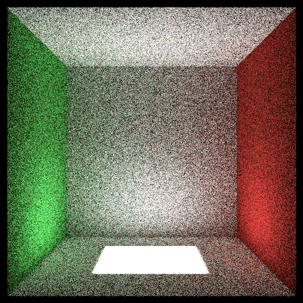
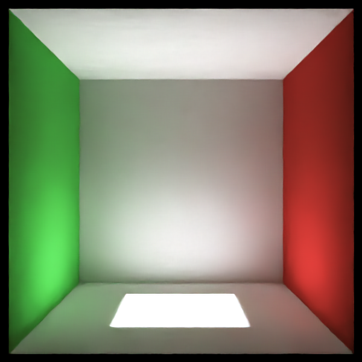

### Kotlin / Java JNI Interface to Intel Open Image Denoise Library (OIDN)


## What is this?

Its a Kotlin library and JNI interface to the [Intel Open Image Denoise Library](https://www.openimagedenoise.org) 

## Before



## After



## Installing

To install, add these dependencies to your **Gradle** file:
```groovy
dependencies {
    compile group: "net.time4tea", name: "oidnjni", version: "0.1.13"
}
```

## How to use

```kotlin
    val oidn = Oidn()
    val color = Oidn.allocateBuffer(image.width, image.height)
    // put some data in the image...
    val output = Oidn.allocateBuffer(image.width, image.height)

    oidn.newDevice(Oidn.DeviceType.DEVICE_TYPE_DEFAULT).use { device ->
        device.raytraceFilter().use { filter ->
            filter.setFilterImage(
                color, output, image.width, image.height
            )
            filter.commit()
            filter.execute()
            device.error()
        }
    }
```

You can look at the `OidnTest` class for an example usage of the library.

The OIDN library requires a specific raster format, which the Java standard library supports, but does 
not give an easy way to create. Use `OidnImages.newBufferedImage()` to create a new buffered image.

Similarly, none of the ImageIO libraries support the raster format. You'll need to create a `BufferedImage`
in a standard format for these functions to work.

```kotlin
fun save(image: BufferedImage, file: File) {
        val dest = BufferedImage(image.width, image.height, BufferedImage.TYPE_INT_RGB)
        try {
            image.copyTo(dest)
            ImageIO.write(dest, "PNG", file)
        } finally {
            dest.flush()
        }
}
```

## Performance

The code is almost certainly far from optimal, no effort has gone into making it performant. However, running the filter
 will dominate the performance of the code - the JNI wrapper is very thin.

Processing the above image takes 0.35s on my laptop.

## TODO

- [ ] Mac / Windows - I have no hardware - contributors wanted!
- [ ] HDR Images    - I have no use-case - contributors wanted!

## Projects that use the OidnJNI library 

Please let me know if your project uses or wants to use this small library

- [Raytrace in a weekend Kotlin](https://github.com/time4tea/raytrace-in-a-weekend-kotlin)

## Contributors

[@leMaik](https://github.com/leMaik)

Contributors are welcome! Either for new use-cases, or new features.

