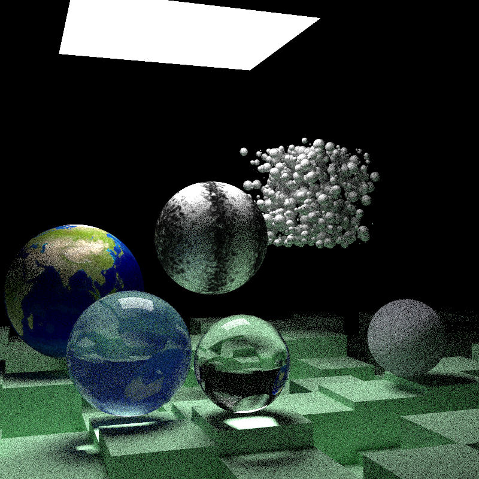

### Kotlin / JNI Interface to Intel OIDN Image Denoise Library

[](https://app.codeship.com/projects/383796)


These plots show the before and after for an image generated on a 
[toy raytracer](https://github.com/time4tea/raytrace-in-a-weekend-kotlin) 

The source image was generated using monte-carlo tracing with 100 samples/pixel. The scene renders in 34s.
This was then passed through the OIDN-JNI library - with the result as shown.

Its pretty good! - and is similar to outputs with many 1,000s of samples/pixel

## Before



## After


## Installing

To install, add these dependencies to your **Gradle** file:
```groovy
dependencies {
    compile group: "net.time4tea", name: "oidnjni", version: "0.1.5"
}
```

## How to use

```kotlin
    val oidn = Oidn()
    val color = Oidn.allocateBuffer(image.width, image.height)
    // put some data in the image...
    val output = Oidn.allocateBuffer(image.width, image.height)

    oidn.newDevice(Oidn.DeviceType.DEVICE_TYPE_DEFAULT).use { device ->
        device.raytraceFilter().use { filter ->
            filter.setFilterImage(
                color, output, image.width, image.height
            )
            filter.commit()
            filter.execute()
            device.error()
        }
    }
```

You can look at the `OidnTest` class to see how to use the library - it requires images in a float format.

## Performance

The code is almost certainly far from optimal, no effort has gone into making it performant. However, running the filter
 will dominate the performance of the code - the JNI wrapper is very thin.

Processing the above image takes 0.35s on my laptop.

## TODO

- [ ] Mac / Windows - I have no hardware - contributors wanted!
- [ ] HDR Images    - I have no use-case - contributors wanted!

## Projects that use the OidnJNI library 

Please let me know if your project uses or wants to use this small library

- [Raytrace in a weekend Kotlin](https://github.com/time4tea/raytrace-in-a-weekend-kotlin)

## Contributors

[@leMaik](https://github.com/leMaik)

Contributors are welcome! Either for new use-cases, or new features.

